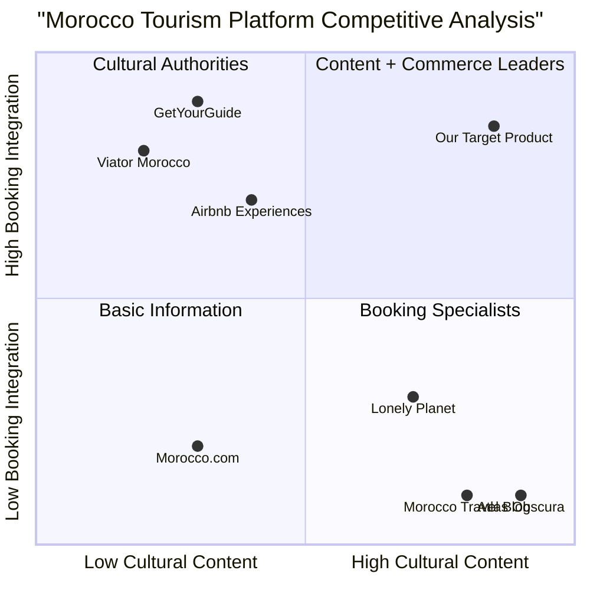

# Product Requirements Document (PRD)
# Moroccan Tourism and Culture Platform

## 1. Language & Project Information

**Language:** English  
**Programming Language:** Next.js, TypeScript, Tailwind CSS, Shadcn-ui  
**Project Name:** morocco_culture_platform  
**Date:** July 24, 2025

### Original Requirements Restatement
Create a comprehensive Moroccan tourism and culture platform featuring:
- HOME PAGE with banner, tourism offers slider, and section previews
- DISCOVER MOROCCO with interactive map, heritage, traditions, cuisine, festivals
- MOROCCAN TOURISM with regional packages, travel guides, virtual tours, reviews
- GALLERY for photos/videos with auto-generated and user-generated content
- CONTENT HUB with mini-Instagram style features, documentaries, articles, podcasts
- TOURISM SERVICES with certified guides booking and transportation services

## 2. Product Definition

### Product Goals

1. **Cultural Immersion Goal**: Create an authentic digital gateway that showcases Morocco's rich cultural heritage through interactive experiences, virtual tours, and multimedia content, positioning the platform as the primary resource for cultural discovery.

2. **Tourism Facilitation Goal**: Establish a comprehensive booking and service platform that connects travelers with certified local guides, transportation services, and curated tourism packages, streamlining the entire travel planning process.

3. **Community Engagement Goal**: Build a vibrant content ecosystem where users can share experiences, access expert-curated content, and engage with Morocco's tourism community through social features and user-generated content.

### User Stories

**As a Cultural Explorer**, I want to explore Morocco's heritage through interactive maps and virtual tours so that I can understand the cultural significance of different regions before visiting.

**As an International Tourist**, I want to book certified guides and transportation services through a single platform so that I can have a seamless and authentic Moroccan experience.

**As a Content Creator**, I want to share my Moroccan travel experiences through photos, videos, and stories so that I can inspire others and contribute to the community.

**As a Local Tourism Provider**, I want to showcase my services and connect with international visitors so that I can grow my business and share authentic Moroccan experiences.

**As a Cultural Enthusiast**, I want to access documentaries, articles, and podcasts about Moroccan culture so that I can deepen my knowledge and stay connected with Morocco's traditions.

### Competitive Analysis

#### Direct Competitors

**1. Morocco.com**
- *Pros*: Comprehensive destination information, government backing, official tourism authority
- *Cons*: Static content, limited interactive features, outdated user interface

**2. Viator Morocco Tours**
- *Pros*: Strong booking system, verified reviews, global brand recognition
- *Cons*: Limited cultural content, focus on packages only, lacks community features

**3. Morocco Travel Blog**
- *Pros*: Rich cultural content, personal experiences, SEO-optimized
- *Cons*: No booking integration, limited multimedia, individual blogger perspective

**4. GetYourGuide Morocco**
- *Pros*: Extensive tour options, mobile app, instant booking
- *Cons*: Generic platform feel, limited Morocco-specific cultural context

**5. Lonely Planet Morocco**
- *Pros*: Authoritative travel content, detailed guides, strong brand trust
- *Cons*: Subscription model, limited interactive features, traditional format

**6. Airbnb Experiences Morocco**
- *Pros*: Local host connections, unique experiences, peer reviews
- *Cons*: Limited cultural education, inconsistent quality, narrow focus

**7. Atlas Obscura Morocco**
- *Pros*: Unique cultural insights, hidden gems focus, engaging storytelling
- *Cons*: Limited practical travel tools, niche audience, no booking system

### Competitive Quadrant Chart



## 3. Technical Specifications

### Requirements Analysis

The Morocco Culture Platform requires a modern, responsive web application that combines rich multimedia content delivery with robust booking functionality. The platform must handle high-resolution images, videos, 360° virtual tours, and real-time booking systems while maintaining optimal performance across devices.

**Core Technical Needs:**
- High-performance media delivery for photos, videos, and virtual tours
- Real-time booking system with payment processing
- Interactive mapping with cultural site markers
- Content management system for blogs, podcasts, and documentaries
- User authentication and profile management
- Review and rating system
- Multi-language support (Arabic, French, English)
- SEO optimization for tourism-related searches
- Mobile-responsive design with offline capabilities

### Requirements Pool

#### P0 Requirements (Must-Have)

**Homepage & Navigation**
- Responsive homepage with video/photo banner showcasing Morocco
- Navigation menu with all six main sections
- Tourism offers slider with featured packages
- Section preview cards linking to main areas

**Content Management**
- Interactive map of Morocco with regional markers
- Photo and video gallery with categorization
- Article and blog content management system
- User-generated content upload and moderation

**Booking System**
- Guide booking system with availability calendar
- Transportation service booking interface
- Payment processing integration
- Booking confirmation and email notifications

**User Experience**
- Mobile-responsive design across all sections
- Fast loading times (<3 seconds)
- Accessibility compliance (WCAG 2.1)
- Search functionality across content

#### P1 Requirements (Should-Have)

**Enhanced Interactivity**
- 360° virtual tours of key locations
- Interactive cultural timeline and history sections
- Social sharing capabilities
- User review and rating system

**Advanced Features**
- Multi-language support (Arabic, French, English)
- Personalized recommendations based on user behavior
- Advanced filtering for guides and tours
- Push notifications for bookings and updates

**Content Features**
- Podcast player integration
- Video documentary streaming
- Mini-Instagram style content feed
- Cultural festival calendar with events

#### P2 Requirements (Nice-to-Have)

**Premium Features**
- VR headset compatibility for virtual tours
- AI-powered travel itinerary suggestions
- Live chat support for booking assistance
- Loyalty program for frequent users

**Advanced Analytics**
- User behavior tracking and analytics
- Conversion funnel analysis
- A/B testing framework
- Performance monitoring dashboard

### UI Design Draft

**Homepage Layout:**
```
Header: Logo | Navigation Menu | Language Selector | User Profile
Hero Section: Full-width video banner with overlay text
Tourism Offers: Horizontal scrolling slider with cards
Section Previews: 2x3 grid of main sections with preview images
Footer: Links, contact info, social media
```

**Discover Morocco Layout:**
```
Interactive Map: Full-width map with clickable regions
Content Tabs: Heritage | Traditions | Clothing | Cuisine | Festivals
Content Grid: Cards with images, descriptions, and "Learn More" buttons
Sidebar: Quick facts, weather, cultural tips
```

**Tourism Services Layout:**
```
Service Categories: Guides | Transportation tabs
Filter Sidebar: Location, price, ratings, specialties
Results Grid: Service provider cards with photos, ratings, pricing
Booking Modal: Calendar, contact form, payment integration
```

### Open Questions

1. **Payment Processing**: Which payment gateways should be integrated for international transactions? Should we support local Moroccan payment methods?

2. **Content Moderation**: What approval process should be implemented for user-generated content? Should there be automated content filtering?

3. **Multilingual Content**: Should cultural content be professionally translated or crowd-sourced? How do we handle Arabic right-to-left text layout?

4. **Virtual Tour Technology**: Should we invest in custom 360° tour development or integrate with existing platforms like Matterport?

5. **Guide Verification**: What certification process should be implemented for tourism guides? How do we verify credentials and maintain quality standards?

6. **Data Privacy**: How do we ensure GDPR compliance for European visitors while handling booking and personal data?

7. **Offline Functionality**: Which features should remain accessible when users have limited internet connectivity during travel?

8. **Scalability**: What server infrastructure is needed to handle peak tourism season traffic and media-heavy content delivery?

---

*This PRD serves as the foundation for developing a comprehensive Moroccan tourism and culture platform that bridges authentic cultural experiences with modern digital convenience.*