# Morocco Culture Platform - System Design

## Implementation Approach

We will build a modern, scalable web application using Next.js 14+ with App Router, TypeScript, and Tailwind CSS. The platform requires a robust architecture to handle:

- **High-performance media delivery** for photos, videos, and 360° virtual tours
- **Real-time booking system** with payment processing integration
- **Interactive mapping** with cultural site markers and regional information
- **Content management system** for multimedia content and user-generated content
- **Multi-language support** with proper RTL layout for Arabic
- **SEO optimization** for tourism-related searches

### Technology Stack Selection:
- **Frontend**: Next.js 14+ (App Router), TypeScript, Tailwind CSS, Shadcn-ui
- **Database**: PostgreSQL with Prisma ORM for complex relationships
- **Media Storage**: Cloudinary for image/video optimization and CDN
- **Authentication**: NextAuth.js with multiple providers
- **Payment Processing**: Stripe for international payments
- **Maps**: Mapbox GL for interactive mapping
- **Virtual Tours**: Three.js for 360° experiences
- **State Management**: Zustand for client-side state
- **Internationalization**: next-intl for multi-language support

## Data Structures and Interfaces

```mermaid
classDiagram
    class User {
        +id: string
        +email: string
        +name: string
        +avatar: string
        +role: UserRole
        +language: string
        +createdAt: DateTime
        +updatedAt: DateTime
        +bookings: Booking[]
        +reviews: Review[]
        +content: UserContent[]
        +profile: UserProfile
        +__init__(email: string, name: string)
        +updateProfile(data: ProfileData): Promise~User~
        +getBookingHistory(): Promise~Booking[]~
    }

    class UserProfile {
        +userId: string
        +bio: string
        +interests: string[]
        +travelPreferences: TravelPreferences
        +nationality: string
        +spokenLanguages: string[]
        +user: User
        +__init__(userId: string)
        +updatePreferences(prefs: TravelPreferences): Promise~void~
    }

    class Guide {
        +id: string
        +userId: string
        +licenseNumber: string
        +specialties: string[]
        +languages: string[]
        +regions: string[]
        +hourlyRate: number
        +isVerified: boolean
        +availability: GuideAvailability[]
        +bookings: GuideBooking[]
        +reviews: Review[]
        +user: User
        +__init__(userId: string, licenseNumber: string)
        +updateAvailability(slots: TimeSlot[]): Promise~void~
        +calculateRating(): Promise~number~
        +getBookings(dateRange: DateRange): Promise~GuideBooking[]~
    }

    class Region {
        +id: string
        +name: string
        +nameAr: string
        +nameFr: string
        +description: string
        +coordinates: Coordinates
        +attractions: Attraction[]
        +tourPackages: TourPackage[]
        +culturalSites: CulturalSite[]
        +__init__(name: string, coordinates: Coordinates)
        +getAttractions(): Promise~Attraction[]~
        +getTourPackages(): Promise~TourPackage[]~
    }

    class CulturalSite {
        +id: string
        +name: string
        +nameAr: string
        +nameFr: string
        +description: string
        +category: CulturalCategory
        +regionId: string
        +coordinates: Coordinates
        +images: MediaFile[]
        +virtualTours: VirtualTour[]
        +region: Region
        +__init__(name: string, regionId: string)
        +addVirtualTour(tour: VirtualTour): Promise~void~
        +getMediaGallery(): Promise~MediaFile[]~
    }

    class TourPackage {
        +id: string
        +title: string
        +description: string
        +duration: number
        +price: number
        +maxParticipants: number
        +regionId: string
        +inclusions: string[]
        +exclusions: string[]
        +itinerary: ItineraryItem[]
        +bookings: TourBooking[]
        +region: Region
        +__init__(title: string, regionId: string)
        +calculateAvailability(date: Date): Promise~number~
        +createBooking(userId: string, participants: number): Promise~TourBooking~
    }

    class Booking {
        +id: string
        +userId: string
        +type: BookingType
        +status: BookingStatus
        +totalAmount: number
        +bookingDate: DateTime
        +serviceDate: DateTime
        +paymentStatus: PaymentStatus
        +user: User
        +payment: Payment
        +__init__(userId: string, type: BookingType)
        +confirmBooking(): Promise~void~
        +cancelBooking(): Promise~void~
        +processPayment(paymentData: PaymentData): Promise~Payment~
    }

    class GuideBooking {
        +bookingId: string
        +guideId: string
        +startTime: DateTime
        +endTime: DateTime
        +location: string
        +specialRequests: string
        +guide: Guide
        +booking: Booking
        +__init__(bookingId: string, guideId: string)
        +updateSchedule(startTime: DateTime, endTime: DateTime): Promise~void~
    }

    class TourBooking {
        +bookingId: string
        +packageId: string
        +participants: number
        +participantDetails: ParticipantInfo[]
        +tourPackage: TourPackage
        +booking: Booking
        +__init__(bookingId: string, packageId: string)
        +addParticipant(info: ParticipantInfo): Promise~void~
    }

    class Review {
        +id: string
        +userId: string
        +targetId: string
        +targetType: ReviewTarget
        +rating: number
        +comment: string
        +images: string[]
        +createdAt: DateTime
        +user: User
        +__init__(userId: string, targetId: string, targetType: ReviewTarget)
        +updateReview(rating: number, comment: string): Promise~void~
    }

    class MediaFile {
        +id: string
        +filename: string
        +url: string
        +thumbnailUrl: string
        +type: MediaType
        +size: number
        +uploadedBy: string
        +tags: string[]
        +culturalSite: CulturalSite
        +__init__(filename: string, url: string, type: MediaType)
        +generateThumbnail(): Promise~string~
        +optimizeForWeb(): Promise~void~
    }

    class VirtualTour {
        +id: string
        +name: string
        +siteId: string
        +panoramaUrls: string[]
        +hotspots: Hotspot[]
        +audioGuide: string
        +duration: number
        +culturalSite: CulturalSite
        +__init__(name: string, siteId: string)
        +addHotspot(hotspot: Hotspot): Promise~void~
        +renderTour(): Promise~TourData~
    }

    class ContentArticle {
        +id: string
        +title: string
        +slug: string
        +content: string
        +authorId: string
        +category: ContentCategory
        +publishedAt: DateTime
        +tags: string[]
        +featuredImage: string
        +isPublished: boolean
        +author: User
        +__init__(title: string, authorId: string)
        +publish(): Promise~void~
        +generateSlug(): string
        +updateContent(content: string): Promise~void~
    }

    class Payment {
        +id: string
        +bookingId: string
        +amount: number
        +currency: string
        +paymentMethod: PaymentMethod
        +status: PaymentStatus
        +stripePaymentId: string
        +processedAt: DateTime
        +booking: Booking
        +__init__(bookingId: string, amount: number)
        +processPayment(paymentData: PaymentData): Promise~PaymentResult~
        +refund(amount: number): Promise~RefundResult~
    }

    %% Relationships
    User ||--o{ Booking : creates
    User ||--o{ Review : writes
    User ||--|| UserProfile : has
    User ||--o| Guide : can_be
    
    Guide ||--o{ GuideBooking : accepts
    Guide ||--o{ Review : receives
    
    Region ||--o{ CulturalSite : contains
    Region ||--o{ TourPackage : offers
    
    CulturalSite ||--o{ MediaFile : has
    CulturalSite ||--o{ VirtualTour : features
    
    TourPackage ||--o{ TourBooking : generates
    
    Booking ||--|| Payment : has
    Booking ||--o| GuideBooking : can_be
    Booking ||--o| TourBooking : can_be
    
    VirtualTour ||--o{ MediaFile : uses
```

## Program Call Flow

```mermaid
sequenceDiagram
    participant U as User
    participant FE as Frontend
    participant API as API Routes
    participant DB as Database
    participant AUTH as Auth Service
    participant PAY as Payment Service
    participant MEDIA as Media Service
    participant EMAIL as Email Service

    %% User Registration & Authentication
    U->>FE: Access platform
    FE->>AUTH: Check authentication
    AUTH-->>FE: Return auth status
    
    alt User not authenticated
        U->>FE: Click sign in/up
        FE->>AUTH: Initiate auth flow
        AUTH->>DB: Create/validate user
        DB-->>AUTH: Return user data
        AUTH-->>FE: Return session
        FE-->>U: Redirect to dashboard
    end

    %% Browse Cultural Content
    U->>FE: Navigate to Discover Morocco
    FE->>API: GET /api/regions
    API->>DB: Query regions with cultural sites
    DB-->>API: Return regions data
    API-->>FE: Return JSON response
    FE-->>U: Display interactive map

    U->>FE: Click on region
    FE->>API: GET /api/regions/:id/cultural-sites
    API->>DB: Query cultural sites
    DB-->>API: Return sites with media
    API->>MEDIA: Get optimized images
    MEDIA-->>API: Return CDN URLs
    API-->>FE: Return sites data
    FE-->>U: Display cultural sites

    %% Virtual Tour Experience
    U->>FE: Start virtual tour
    FE->>API: GET /api/virtual-tours/:id
    API->>DB: Query tour data
    DB-->>API: Return tour with panoramas
    API-->>FE: Return tour configuration
    FE->>FE: Initialize 3D viewer
    FE-->>U: Render 360° experience

    %% Guide Booking Flow
    U->>FE: Browse tourism services
    FE->>API: GET /api/guides
    API->>DB: Query available guides
    DB-->>API: Return guides with availability
    API-->>FE: Return guides data
    FE-->>U: Display guide listings

    U->>FE: Select guide and time slot
    FE->>API: POST /api/bookings/guide
    API->>AUTH: Validate user session
    AUTH-->>API: Confirm user identity
    API->>DB: Create booking record
    DB-->>API: Return booking ID
    
    API->>PAY: Create payment intent
    PAY-->>API: Return payment details
    API-->>FE: Return booking with payment
    FE-->>U: Show payment form

    U->>FE: Submit payment
    FE->>PAY: Process payment
    PAY->>DB: Update payment status
    PAY-->>FE: Return payment result
    
    alt Payment successful
        FE->>API: POST /api/bookings/:id/confirm
        API->>DB: Update booking status
        API->>EMAIL: Send confirmation email
        EMAIL-->>U: Booking confirmation
        API-->>FE: Booking confirmed
        FE-->>U: Success message
    else Payment failed
        FE->>API: POST /api/bookings/:id/cancel
        API->>DB: Cancel booking
        API-->>FE: Booking cancelled
        FE-->>U: Payment error message
    end

    %% Content Management
    U->>FE: Upload travel photos
    FE->>MEDIA: Upload to Cloudinary
    MEDIA-->>FE: Return optimized URLs
    FE->>API: POST /api/user-content
    API->>DB: Save content metadata
    DB-->>API: Return content ID
    API-->>FE: Content saved
    FE-->>U: Upload successful

    %% Review System
    U->>FE: Submit guide review
    FE->>API: POST /api/reviews
    API->>AUTH: Validate user booking
    AUTH->>DB: Check booking history
    DB-->>AUTH: Confirm booking exists
    AUTH-->>API: User authorized
    API->>DB: Create review record
    DB-->>API: Review saved
    API-->>FE: Review submitted
    FE-->>U: Thank you message

    %% Search and Discovery
    U->>FE: Search for "desert tours"
    FE->>API: GET /api/search?q=desert tours
    API->>DB: Full-text search across content
    DB-->>API: Return matching results
    API-->>FE: Return search results
    FE-->>U: Display filtered content
```



## Anything UNCLEAR

Several aspects require clarification to complete the implementation:

1. **Payment Gateway Integration**: Need to confirm which payment methods to support beyond Stripe - should we integrate local Moroccan payment processors like CMI or Maroc Telecommerce?

2. **Content Moderation Strategy**: Requires decision on automated vs. manual content moderation for user-generated photos, reviews, and articles. Should we implement AI-based content filtering?

3. **Virtual Tour Technology**: Need to decide between building custom 360° tour viewer with Three.js or integrating with existing platforms like Matterport or Kuula.

4. **Guide Verification Process**: Requires defining the certification workflow for tourism guides - integration with Moroccan tourism authorities or manual verification process?

5. **Multi-language Content Strategy**: Need clarification on content translation approach - professional translation services, community translation, or AI-assisted translation?

6. **Offline Functionality Scope**: Which features should work offline during travel - cached maps, downloaded tour guides, or booking confirmations?

7. **Media Storage Strategy**: Confirm media storage requirements - file size limits, video streaming quality options, and CDN geographic distribution needs.

8. **Real-time Features**: Should we implement real-time chat for booking assistance, live guide availability updates, or real-time notifications?