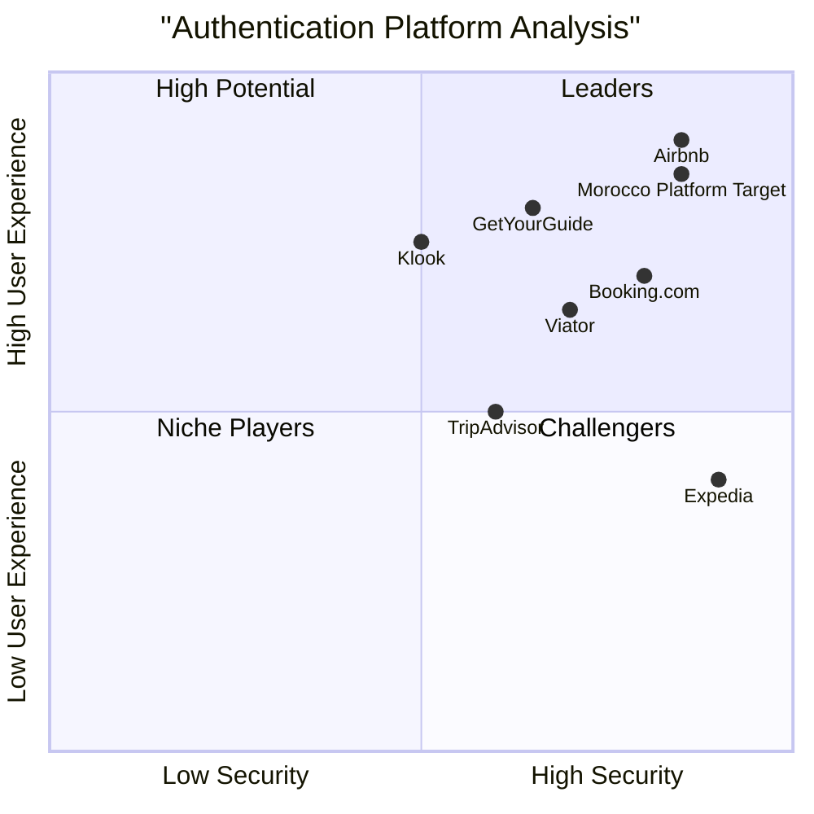

# Authentication System PRD - Morocco Tourism Platform

## 1. Language & Project Information

**Language:** English  
**Programming Language:** TypeScript, React, Shadcn-UI, Tailwind CSS  
**Project Name:** morocco_platform_auth_system  
**Original Requirements:** Implement comprehensive authentication and admin system for the existing Morocco tourism platform with login/register functionality and admin panel capabilities.

## 2. Product Definition

### 2.1 Product Goals

1. **Secure User Authentication**: Provide robust, secure authentication system supporting multiple user types with comprehensive security measures including 2FA, password policies, and session management.

2. **Role-Based Access Control**: Implement granular permission system enabling different user roles (Tourist, Guide, Admin, Super Admin) with appropriate access levels to platform features and content management.

3. **Comprehensive Admin Management**: Deliver powerful admin panel with user management, content moderation, analytics dashboard, and platform configuration capabilities for efficient platform operation.

### 2.2 User Stories

**As a Tourist**, I want to register and login to the platform so that I can book tours, save favorite destinations, and manage my travel preferences.

**As a Tourist Guide**, I want to create a professional profile with verification so that I can offer my services, manage bookings, and showcase my expertise to potential clients.

**As a Platform Admin**, I want to manage user accounts and moderate content so that I can ensure platform quality and handle user issues effectively.

**As a Super Admin**, I want full system access and analytics dashboard so that I can monitor platform performance, configure system settings, and make strategic decisions.

**As a User**, I want secure password recovery and 2FA options so that I can maintain account security and regain access if needed.

### 2.3 Competitive Analysis

| Product | Pros | Cons |
|---------|------|------|
| **Airbnb** | - Seamless social login integration<br>- Excellent user verification system<br>- Robust host/guest role management | - Complex onboarding for hosts<br>- Limited customization for regional platforms |
| **Booking.com** | - Multi-language authentication<br>- Strong booking integration<br>- Mobile-optimized flows | - Basic admin interface<br>- Limited social features integration |
| **TripAdvisor** | - Rich user profile system<br>- Content moderation tools<br>- Review-based trust system | - Outdated UI/UX design<br>- Complex permission structure |
| **Viator** | - Guide verification system<br>- Booking-integrated auth<br>- Professional dashboard | - Limited user customization<br>- Weak social login options |
| **GetYourGuide** | - Mobile-first authentication<br>- Payment-integrated profiles<br>- Multi-role support | - Basic admin analytics<br>- Limited content management |
| **Expedia** | - Enterprise-level security<br>- Comprehensive user management<br>- Strong API integration | - Complex user experience<br>- Heavy resource requirements |
| **Klook** | - Regional customization<br>- Social media integration<br>- Quick registration process | - Limited admin features<br>- Basic role management |

### 2.4 Competitive Quadrant Chart



## 3. Technical Specifications

### 3.1 Requirements Analysis

The authentication system must integrate seamlessly with the existing Morocco tourism platform while providing enterprise-level security and user experience. Key technical considerations include:

- **Frontend Integration**: Seamless integration with existing React/TypeScript codebase
- **State Management**: User authentication state across all platform sections
- **Security Implementation**: JWT tokens, encryption, rate limiting, and security headers
- **Database Design**: User profiles, roles, permissions, and audit logs
- **API Design**: RESTful endpoints for authentication and user management
- **Mobile Responsiveness**: Optimal experience across all devices
- **Performance**: Fast authentication flows and efficient session management

### 3.2 Requirements Pool

#### P0 Requirements (Must-Have)

1. **User Registration & Login**
   - Email/password registration with validation
   - Secure login with session management
   - Password reset functionality
   - Email verification system

2. **Role-Based Access Control**
   - Tourist, Guide, Admin, Super Admin roles
   - Permission-based feature access
   - Role assignment and management

3. **Basic Admin Panel**
   - User management dashboard
   - Basic analytics overview
   - Content moderation tools

4. **Security Fundamentals**
   - Password encryption and policies
   - JWT token implementation
   - Session timeout management
   - Basic rate limiting

#### P1 Requirements (Should-Have)

5. **Enhanced Authentication**
   - Social login (Google, Facebook, Apple)
   - Two-factor authentication (2FA)
   - Remember me functionality
   - Multi-device session management

6. **Advanced Admin Features**
   - Detailed user analytics
   - Content approval workflows
   - System configuration panel
   - Audit logs and activity tracking

7. **User Profile Management**
   - Complete profile customization
   - Preference settings
   - Booking history integration
   - Favorite content management

8. **Security Enhancements**
   - Suspicious activity detection
   - Account lockout mechanisms
   - GDPR compliance features
   - Advanced rate limiting

#### P2 Requirements (Nice-to-Have)

9. **Advanced Features**
   - Biometric authentication support
   - Single Sign-On (SSO) integration
   - Advanced analytics dashboard
   - A/B testing for auth flows

10. **Integration Features**
    - Third-party service integrations
    - API key management
    - Webhook notifications
    - Advanced reporting tools

### 3.3 UI Design Draft

#### Authentication Pages

**Login Page:**
- Clean, centered form with Morocco-themed branding
- Email/password fields with validation
- Social login buttons
- "Remember me" and "Forgot password" options
- Language selector integration

**Registration Page:**
- Multi-step registration process
- Role selection (Tourist/Guide)
- Email verification flow
- Terms of service acceptance
- Profile picture upload option

**Password Reset:**
- Email input with validation
- Clear instructions and confirmation
- Secure token-based reset process
- New password creation with strength indicator

#### Admin Panel Layout

**Dashboard Overview:**
- Key metrics cards (users, bookings, content)
- Recent activity feed
- Quick action buttons
- Navigation sidebar with role-based items

**User Management:**
- Searchable user table with filters
- Bulk actions (approve, suspend, delete)
- Individual user detail modals
- Role assignment interface

**Content Moderation:**
- Pending content queue
- Approval/rejection workflows
- Content preview and editing
- Batch processing capabilities

### 3.4 Database Schema Design

#### Users Table
```sql
CREATE TABLE users (
  id UUID PRIMARY KEY DEFAULT gen_random_uuid(),
  email VARCHAR(255) UNIQUE NOT NULL,
  password_hash VARCHAR(255) NOT NULL,
  first_name VARCHAR(100),
  last_name VARCHAR(100),
  phone VARCHAR(20),
  avatar_url TEXT,
  role user_role NOT NULL DEFAULT 'tourist',
  status user_status NOT NULL DEFAULT 'pending',
  email_verified BOOLEAN DEFAULT FALSE,
  two_factor_enabled BOOLEAN DEFAULT FALSE,
  two_factor_secret VARCHAR(32),
  last_login TIMESTAMP,
  login_count INTEGER DEFAULT 0,
  failed_login_attempts INTEGER DEFAULT 0,
  account_locked_until TIMESTAMP,
  preferences JSONB,
  created_at TIMESTAMP DEFAULT NOW(),
  updated_at TIMESTAMP DEFAULT NOW()
);
```

#### Sessions Table
```sql
CREATE TABLE user_sessions (
  id UUID PRIMARY KEY DEFAULT gen_random_uuid(),
  user_id UUID REFERENCES users(id) ON DELETE CASCADE,
  token_hash VARCHAR(255) NOT NULL,
  device_info JSONB,
  ip_address INET,
  location VARCHAR(100),
  expires_at TIMESTAMP NOT NULL,
  last_activity TIMESTAMP DEFAULT NOW(),
  created_at TIMESTAMP DEFAULT NOW()
);
```

#### Audit Logs Table
```sql
CREATE TABLE audit_logs (
  id UUID PRIMARY KEY DEFAULT gen_random_uuid(),
  user_id UUID REFERENCES users(id) ON DELETE SET NULL,
  action VARCHAR(100) NOT NULL,
  resource_type VARCHAR(50),
  resource_id UUID,
  details JSONB,
  ip_address INET,
  user_agent TEXT,
  created_at TIMESTAMP DEFAULT NOW()
);
```

### 3.5 API Endpoints Specification

#### Authentication Endpoints

**POST /api/auth/register**
```typescript
// Request
{
  email: string;
  password: string;
  firstName: string;
  lastName: string;
  role: 'tourist' | 'guide';
  phone?: string;
}

// Response
{
  success: boolean;
  message: string;
  data?: {
    user: UserProfile;
    requiresVerification: boolean;
  }
}
```

**POST /api/auth/login**
```typescript
// Request
{
  email: string;
  password: string;
  rememberMe?: boolean;
  twoFactorCode?: string;
}

// Response
{
  success: boolean;
  message: string;
  data?: {
    user: UserProfile;
    accessToken: string;
    refreshToken: string;
    requiresTwoFactor?: boolean;
  }
}
```

**POST /api/auth/forgot-password**
```typescript
// Request
{
  email: string;
}

// Response
{
  success: boolean;
  message: string;
}
```

#### Admin Endpoints

**GET /api/admin/users**
```typescript
// Query Parameters
{
  page?: number;
  limit?: number;
  search?: string;
  role?: string;
  status?: string;
  sortBy?: string;
  sortOrder?: 'asc' | 'desc';
}

// Response
{
  success: boolean;
  data: {
    users: UserProfile[];
    pagination: {
      total: number;
      page: number;
      limit: number;
      totalPages: number;
    }
  }
}
```

**GET /api/admin/analytics**
```typescript
// Response
{
  success: boolean;
  data: {
    totalUsers: number;
    activeUsers: number;
    newRegistrations: number;
    usersByRole: Record<string, number>;
    loginActivity: Array<{
      date: string;
      count: number;
    }>;
    topRegions: Array<{
      region: string;
      userCount: number;
    }>;
  }
}
```

### 3.6 Security Implementation

#### Password Policies
```typescript
const passwordPolicy = {
  minLength: 8,
  maxLength: 128,
  requireUppercase: true,
  requireLowercase: true,
  requireNumbers: true,
  requireSpecialChars: true,
  preventCommonPasswords: true,
  preventUserInfoInPassword: true,
  historyLimit: 5 // Prevent reusing last 5 passwords
};
```

#### Rate Limiting Configuration
```typescript
const rateLimits = {
  login: {
    windowMs: 15 * 60 * 1000, // 15 minutes
    max: 5, // 5 attempts per window
    lockoutDuration: 30 * 60 * 1000 // 30 minutes lockout
  },
  registration: {
    windowMs: 60 * 60 * 1000, // 1 hour
    max: 3, // 3 registrations per IP per hour
  },
  passwordReset: {
    windowMs: 60 * 60 * 1000, // 1 hour
    max: 3, // 3 reset attempts per hour
  }
};
```

#### JWT Configuration
```typescript
const jwtConfig = {
  accessTokenExpiry: '15m',
  refreshTokenExpiry: '7d',
  algorithm: 'RS256',
  issuer: 'morocco-platform',
  audience: 'morocco-platform-users'
};
```

### 3.7 Integration Points

#### Existing Platform Integration
1. **Header Navigation**: User menu with profile/logout options
2. **Tourism Services**: Guide profiles and booking integration
3. **Content Hub**: User-generated content permissions
4. **Gallery**: Photo upload and user attribution
5. **Discover Morocco**: Personalized recommendations
6. **Home Page**: Personalized content and user greetings

#### Third-Party Integrations
1. **Email Service**: SendGrid or AWS SES for transactional emails
2. **SMS Service**: Twilio for 2FA and notifications
3. **Social Logins**: Google, Facebook, Apple OAuth
4. **Analytics**: Google Analytics and custom tracking
5. **Storage**: AWS S3 or Cloudinary for profile images
6. **Payment**: Stripe for premium features (future)

### 3.8 Open Questions

1. **Backend Technology**: Should we use Supabase (if enabled) or implement custom backend with Node.js/Express?

2. **Social Login Priority**: Which social login providers are most important for Moroccan users?

3. **Guide Verification**: What documentation/verification process is required for tourist guides?

4. **Content Moderation**: Should we implement automated content moderation or manual review only?

5. **GDPR Compliance**: What specific GDPR requirements apply to Moroccan tourism data?

6. **Mobile App**: Will there be a future mobile app requiring different authentication flows?

7. **Multi-language Support**: Should authentication emails be translated into Arabic and French?

8. **Payment Integration**: When will payment processing be integrated with user accounts?

### 3.9 Implementation Phases

#### Phase 1: Core Authentication (Week 1-2)
- Basic registration/login functionality
- JWT token implementation
- Password reset system
- Email verification

#### Phase 2: Role Management (Week 3)
- Role-based access control
- Permission system implementation
- Basic admin panel
- User profile management

#### Phase 3: Security Enhancements (Week 4)
- Two-factor authentication
- Advanced rate limiting
- Suspicious activity detection
- Security audit logging

#### Phase 4: Admin Features (Week 5-6)
- Advanced admin dashboard
- User management tools
- Content moderation system
- Analytics and reporting

#### Phase 5: Integration & Polish (Week 7-8)
- Platform integration testing
- Social login implementation
- Performance optimization
- Mobile responsiveness refinement

### 3.10 Success Metrics

#### Technical Metrics
- Authentication response time < 200ms
- 99.9% uptime for auth services
- Zero security vulnerabilities
- < 1% failed login rate due to system issues

#### User Experience Metrics
- Registration completion rate > 85%
- Login success rate > 98%
- Password reset completion rate > 90%
- User satisfaction score > 4.5/5

#### Business Metrics
- User registration growth rate
- Active user retention rate
- Guide verification completion rate
- Admin efficiency improvements

### 3.11 Risk Assessment

#### High Risk
- **Security Breaches**: Implement comprehensive security measures and regular audits
- **Data Privacy Violations**: Ensure GDPR compliance and data protection policies
- **Performance Issues**: Load testing and scalable architecture design

#### Medium Risk
- **Integration Complexity**: Thorough testing of existing platform integration
- **User Adoption**: Clear onboarding and user experience optimization
- **Third-party Dependencies**: Backup plans for critical service failures

#### Low Risk
- **Feature Scope Creep**: Clear requirements documentation and phase planning
- **Technology Changes**: Modern, stable technology stack selection
- **Team Coordination**: Regular communication and code review processes

## 4. Conclusion

This PRD provides a comprehensive roadmap for implementing a robust authentication and admin system for the Morocco tourism platform. The design balances security, user experience, and functionality while ensuring seamless integration with the existing platform architecture.

The phased implementation approach allows for iterative development and testing, ensuring each component is thoroughly validated before moving to the next phase. Regular security audits and user feedback integration will be crucial for maintaining system integrity and user satisfaction.

Success will be measured through technical performance metrics, user experience indicators, and business growth metrics, ensuring the authentication system supports the platform's goals of becoming Morocco's premier tourism destination platform.