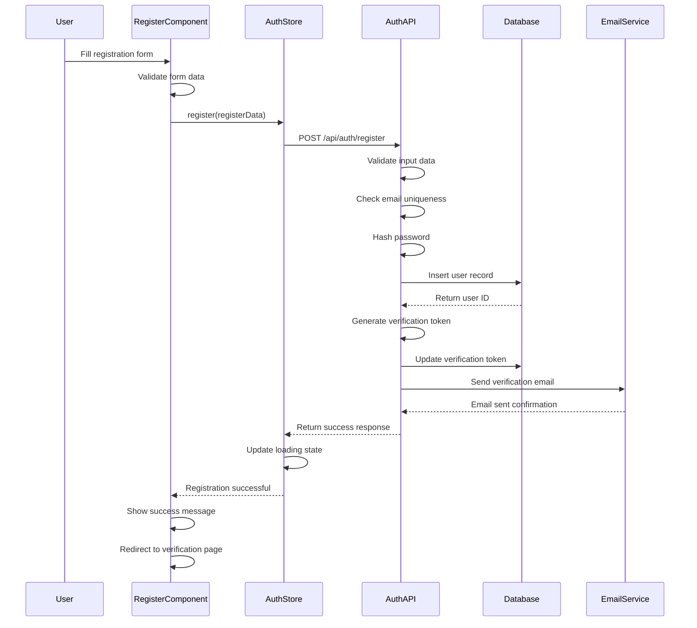
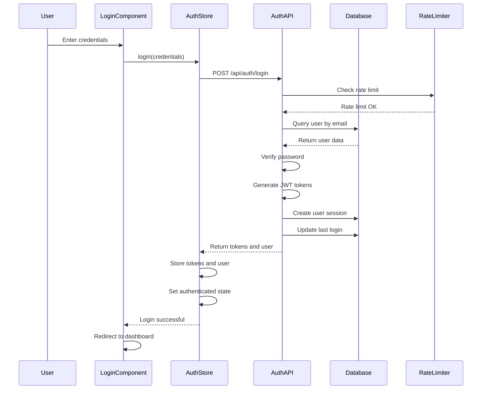
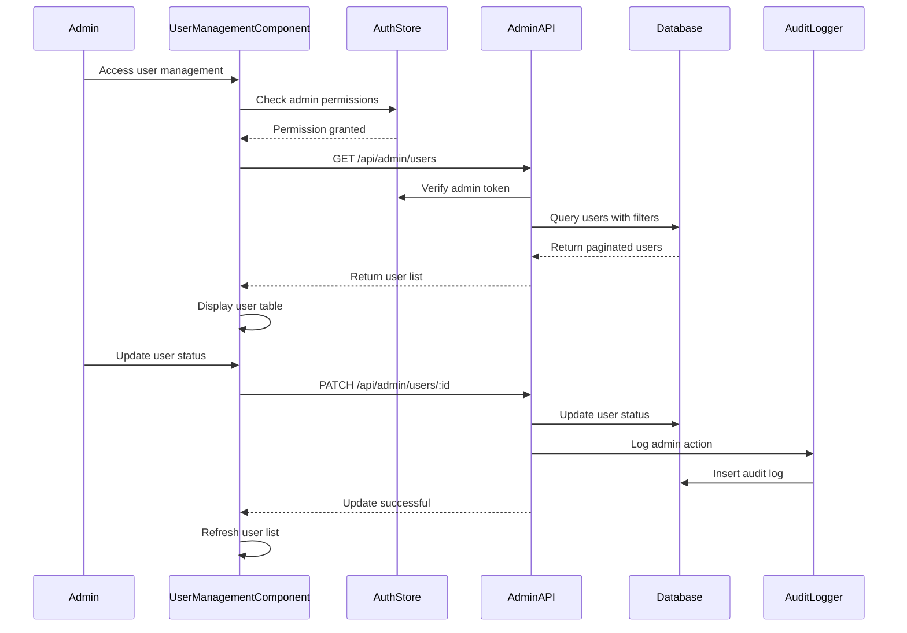
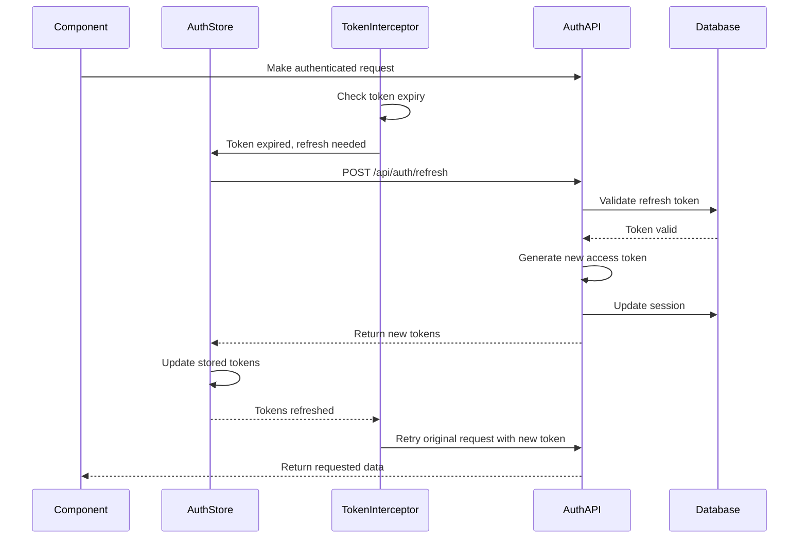
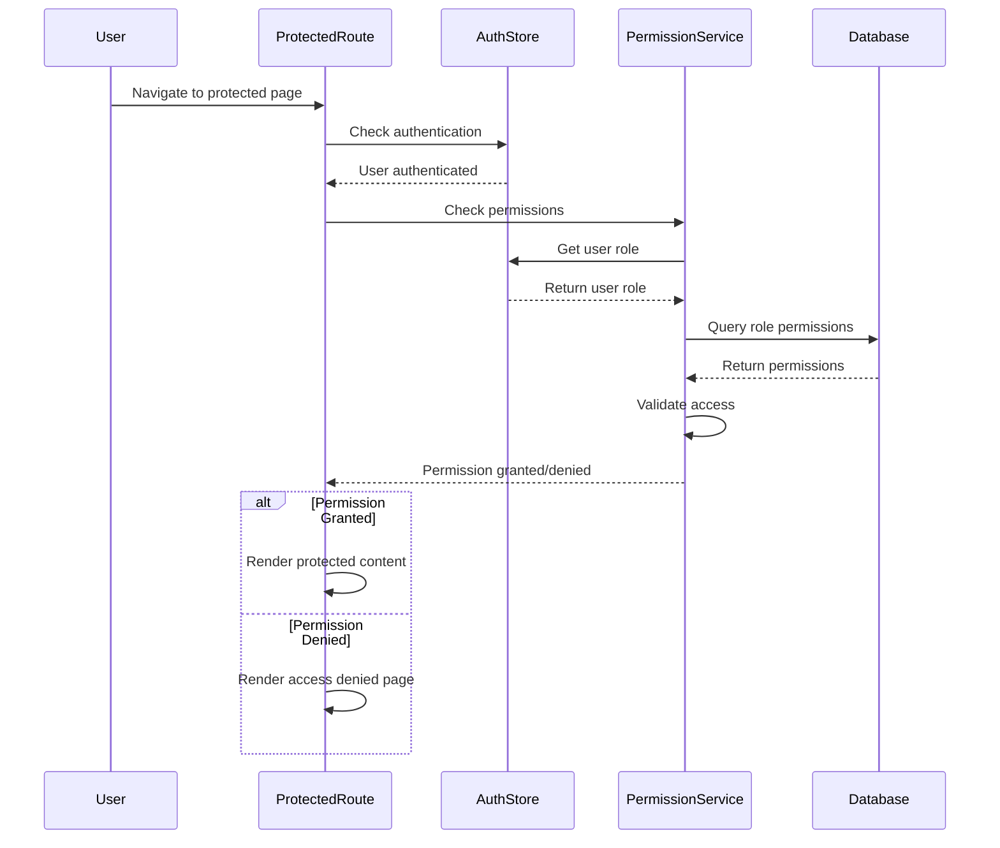

# Authentication System Design - Morocco Tourism Platform

## Implementation Approach

We will implement a comprehensive authentication system for the Morocco tourism platform using the existing React + TypeScript + Shadcn-UI tech stack. The system will provide secure user authentication, role-based access control, and a powerful admin panel while seamlessly integrating with the existing platform.

### Key Design Decisions:
- **Frontend**: React components with TypeScript for type safety
- **State Management**: Zustand for authentication state management
- **UI Components**: Shadcn-UI components for consistent design
- **Authentication**: JWT tokens with refresh token rotation
- **Security**: Bcrypt for password hashing, rate limiting with Redis
- **Database**: PostgreSQL with optimized indexes for performance
- **Email Service**: SendGrid for transactional emails
- **File Storage**: Cloudinary for profile images

### Difficult Points Analysis:
1. **Session Management**: Implementing secure JWT token handling with automatic refresh
2. **Role-Based Access Control**: Granular permissions system across platform sections
3. **Admin Panel Integration**: Seamless integration with existing platform navigation
4. **Security Implementation**: Comprehensive rate limiting and attack prevention
5. **Multi-device Support**: Managing user sessions across different devices

## Data Structures and Interfaces

### Core Authentication Types

```typescript
// User Role Definitions
type UserRole = 'tourist' | 'guide' | 'admin' | 'super_admin';
type UserStatus = 'pending' | 'active' | 'suspended' | 'banned';

// User Profile Interface
interface UserProfile {
  id: string;
  email: string;
  firstName: string;
  lastName: string;
  phone?: string;
  avatarUrl?: string;
  role: UserRole;
  status: UserStatus;
  emailVerified: boolean;
  twoFactorEnabled: boolean;
  lastLogin?: Date;
  preferences: UserPreferences;
  createdAt: Date;
  updatedAt: Date;
}

// User Preferences
interface UserPreferences {
  language: 'en' | 'fr' | 'ar';
  notifications: {
    email: boolean;
    sms: boolean;
    push: boolean;
  };
  privacy: {
    profileVisible: boolean;
    showPhone: boolean;
    showEmail: boolean;
  };
}

// Authentication Tokens
interface AuthTokens {
  accessToken: string;
  refreshToken: string;
  expiresAt: Date;
}

// Login Request/Response
interface LoginRequest {
  email: string;
  password: string;
  rememberMe?: boolean;
  twoFactorCode?: string;
}

interface LoginResponse {
  success: boolean;
  message: string;
  data?: {
    user: UserProfile;
    tokens: AuthTokens;
    requiresTwoFactor?: boolean;
  };
}

// Registration Request
interface RegisterRequest {
  email: string;
  password: string;
  firstName: string;
  lastName: string;
  role: 'tourist' | 'guide';
  phone?: string;
  agreeToTerms: boolean;
}
```

### Database Schema Tables

```typescript
// Users Table Schema
interface UsersTable {
  id: string; // UUID
  email: string; // UNIQUE
  password_hash: string;
  first_name: string;
  last_name: string;
  phone?: string;
  avatar_url?: string;
  role: UserRole;
  status: UserStatus;
  email_verified: boolean;
  email_verification_token?: string;
  email_verification_expires?: Date;
  two_factor_enabled: boolean;
  two_factor_secret?: string;
  password_reset_token?: string;
  password_reset_expires?: Date;
  last_login?: Date;
  login_count: number;
  failed_login_attempts: number;
  account_locked_until?: Date;
  preferences: UserPreferences;
  created_at: Date;
  updated_at: Date;
}

// User Sessions Table
interface UserSessionsTable {
  id: string;
  user_id: string; // FK to users.id
  token_hash: string;
  refresh_token_hash: string;
  device_info: {
    userAgent: string;
    platform: string;
    browser: string;
  };
  ip_address: string;
  location?: string;
  expires_at: Date;
  last_activity: Date;
  created_at: Date;
}

// Role Permissions Table
interface RolePermissionsTable {
  id: string;
  role: UserRole;
  resource: string; // e.g., 'tourism_packages', 'users', 'content'
  actions: string[]; // ['read', 'write', 'delete', 'admin']
  created_at: Date;
}

// Audit Logs Table
interface AuditLogsTable {
  id: string;
  user_id?: string;
  action: string;
  resource_type: string;
  resource_id?: string;
  details: Record<string, any>;
  ip_address: string;
  user_agent: string;
  created_at: Date;
}
```

### Frontend Component Architecture

```typescript
// Authentication Context
interface AuthContextType {
  user: UserProfile | null;
  isAuthenticated: boolean;
  isLoading: boolean;
  login: (credentials: LoginRequest) => Promise<LoginResponse>;
  register: (data: RegisterRequest) => Promise<RegisterResponse>;
  logout: () => Promise<void>;
  refreshToken: () => Promise<boolean>;
  updateProfile: (data: Partial<UserProfile>) => Promise<void>;
  hasPermission: (resource: string, action: string) => boolean;
}

// Authentication Store (Zustand)
interface AuthStore {
  user: UserProfile | null;
  tokens: AuthTokens | null;
  isAuthenticated: boolean;
  isLoading: boolean;
  
  // Actions
  setUser: (user: UserProfile) => void;
  setTokens: (tokens: AuthTokens) => void;
  clearAuth: () => void;
  updateUser: (updates: Partial<UserProfile>) => void;
}

// Protected Route Component
interface ProtectedRouteProps {
  children: React.ReactNode;
  requiredRole?: UserRole;
  requiredPermission?: {
    resource: string;
    action: string;
  };
  fallback?: React.ReactNode;
}
```

### API Response Types

```typescript
// Generic API Response
interface ApiResponse<T = any> {
  success: boolean;
  message: string;
  data?: T;
  errors?: Record<string, string[]>;
}

// Admin Dashboard Data
interface AdminDashboardData {
  totalUsers: number;
  activeUsers: number;
  newRegistrations: number;
  usersByRole: Record<UserRole, number>;
  loginActivity: Array<{
    date: string;
    count: number;
  }>;
  topRegions: Array<{
    region: string;
    userCount: number;
  }>;
  recentActivity: Array<{
    id: string;
    user: string;
    action: string;
    timestamp: Date;
  }>;
}

// User Management List
interface UserListResponse {
  users: UserProfile[];
  pagination: {
    total: number;
    page: number;
    limit: number;
    totalPages: number;
  };
  filters: {
    roles: UserRole[];
    statuses: UserStatus[];
  };
}
```

## Program Call Flow

### User Registration Flow



### User Login Flow



### Admin User Management Flow



### JWT Token Refresh Flow



### Role-Based Access Control Flow



## Security Architecture

### Password Security Implementation

```typescript
// Password hashing configuration
const BCRYPT_ROUNDS = 12;

class PasswordService {
  static async hashPassword(password: string): Promise<string> {
    return bcrypt.hash(password, BCRYPT_ROUNDS);
  }
  
  static async verifyPassword(password: string, hash: string): Promise<boolean> {
    return bcrypt.compare(password, hash);
  }
  
  static validatePasswordStrength(password: string): ValidationResult {
    const errors: string[] = [];
    
    if (password.length < 8) errors.push('Password must be at least 8 characters');
    if (!/[A-Z]/.test(password)) errors.push('Password must contain uppercase letter');
    if (!/[a-z]/.test(password)) errors.push('Password must contain lowercase letter');
    if (!/\d/.test(password)) errors.push('Password must contain number');
    if (!/[!@#$%^&*]/.test(password)) errors.push('Password must contain special character');
    
    return {
      isValid: errors.length === 0,
      errors
    };
  }
}
```

### JWT Token Implementation

```typescript
// JWT service configuration
class JWTService {
  private static readonly ACCESS_TOKEN_EXPIRY = '15m';
  private static readonly REFRESH_TOKEN_EXPIRY = '7d';
  
  static generateTokens(user: UserProfile): AuthTokens {
    const payload = {
      userId: user.id,
      email: user.email,
      role: user.role
    };
    
    const accessToken = jwt.sign(payload, process.env.JWT_SECRET!, {
      expiresIn: this.ACCESS_TOKEN_EXPIRY,
      issuer: 'morocco-platform',
      audience: 'morocco-platform-users'
    });
    
    const refreshToken = jwt.sign(
      { userId: user.id },
      process.env.JWT_REFRESH_SECRET!,
      { expiresIn: this.REFRESH_TOKEN_EXPIRY }
    );
    
    return {
      accessToken,
      refreshToken,
      expiresAt: new Date(Date.now() + 15 * 60 * 1000) // 15 minutes
    };
  }
  
  static verifyAccessToken(token: string): JWTPayload | null {
    try {
      return jwt.verify(token, process.env.JWT_SECRET!) as JWTPayload;
    } catch {
      return null;
    }
  }
}
```

### Rate Limiting Strategy

```typescript
// Rate limiting configuration
class RateLimitService {
  private static readonly LIMITS = {
    login: { windowMs: 15 * 60 * 1000, max: 5 }, // 5 attempts per 15 minutes
    register: { windowMs: 60 * 60 * 1000, max: 3 }, // 3 registrations per hour
    passwordReset: { windowMs: 60 * 60 * 1000, max: 3 }, // 3 resets per hour
    general: { windowMs: 15 * 60 * 1000, max: 100 } // 100 requests per 15 minutes
  };
  
  static async checkRateLimit(key: string, type: keyof typeof RateLimitService.LIMITS): Promise<boolean> {
    const limit = this.LIMITS[type];
    const count = await redis.incr(`ratelimit:${type}:${key}`);
    
    if (count === 1) {
      await redis.expire(`ratelimit:${type}:${key}`, limit.windowMs / 1000);
    }
    
    return count <= limit.max;
  }
}
```

## Admin Panel System Design

### Admin Dashboard Architecture

```typescript
// Admin dashboard layout component
interface AdminDashboardProps {
  user: UserProfile;
  permissions: Permission[];
}

// Admin navigation structure
const ADMIN_NAVIGATION = {
  dashboard: {
    label: 'Dashboard',
    icon: 'dashboard',
    permissions: ['admin.dashboard.read']
  },
  users: {
    label: 'User Management',
    icon: 'users',
    permissions: ['admin.users.read'],
    children: {
      list: { label: 'All Users', permissions: ['admin.users.read'] },
      guides: { label: 'Guide Applications', permissions: ['admin.guides.read'] },
      banned: { label: 'Banned Users', permissions: ['admin.users.moderate'] }
    }
  },
  content: {
    label: 'Content Management',
    icon: 'content',
    permissions: ['admin.content.read'],
    children: {
      pending: { label: 'Pending Approval', permissions: ['admin.content.moderate'] },
      published: { label: 'Published Content', permissions: ['admin.content.read'] },
      reported: { label: 'Reported Content', permissions: ['admin.content.moderate'] }
    }
  },
  analytics: {
    label: 'Analytics',
    icon: 'analytics',
    permissions: ['admin.analytics.read']
  },
  settings: {
    label: 'System Settings',
    icon: 'settings',
    permissions: ['admin.settings.read']
  }
};
```

### Role-Based Permission System

```typescript
// Permission definitions
const PERMISSIONS = {
  // User management
  'admin.users.read': ['admin', 'super_admin'],
  'admin.users.write': ['admin', 'super_admin'],
  'admin.users.delete': ['super_admin'],
  'admin.users.moderate': ['admin', 'super_admin'],
  
  // Content management
  'admin.content.read': ['admin', 'super_admin'],
  'admin.content.moderate': ['admin', 'super_admin'],
  'admin.content.delete': ['super_admin'],
  
  // Guide management
  'admin.guides.read': ['admin', 'super_admin'],
  'admin.guides.approve': ['admin', 'super_admin'],
  
  // System settings
  'admin.settings.read': ['super_admin'],
  'admin.settings.write': ['super_admin'],
  
  // Analytics
  'admin.analytics.read': ['admin', 'super_admin'],
  
  // Tourism content
  'tourism.packages.create': ['guide', 'admin', 'super_admin'],
  'tourism.packages.edit': ['guide', 'admin', 'super_admin'],
  'tourism.bookings.manage': ['guide', 'admin', 'super_admin']
};

class PermissionService {
  static hasPermission(userRole: UserRole, permission: string): boolean {
    return PERMISSIONS[permission]?.includes(userRole) ?? false;
  }
  
  static getAccessibleRoutes(userRole: UserRole): string[] {
    return Object.keys(PERMISSIONS).filter(permission => 
      this.hasPermission(userRole, permission)
    );
  }
}
```

## Integration Points

### Existing Platform Integration

#### Header Navigation Integration
```typescript
// Enhanced header with authentication
interface HeaderProps {
  user: UserProfile | null;
  isAuthenticated: boolean;
  onLogout: () => void;
}

const Header: React.FC<HeaderProps> = ({ user, isAuthenticated, onLogout }) => {
  return (
    <header className="bg-white shadow-sm">
      <nav className="flex items-center justify-between">
        {/* Existing navigation items */}
        <div className="flex items-center space-x-4">
          <Link to="/">Home</Link>
          <Link to="/discover">Discover Morocco</Link>
          <Link to="/tourism">Tourism</Link>
          {/* ... other links */}
        </div>
        
        {/* Authentication section */}
        <div className="flex items-center space-x-4">
          {isAuthenticated ? (
            <UserMenu user={user} onLogout={onLogout} />
          ) : (
            <div className="flex space-x-2">
              <Button variant="ghost" asChild>
                <Link to="/login">Login</Link>
              </Button>
              <Button asChild>
                <Link to="/register">Register</Link>
              </Button>
            </div>
          )}
          <LanguageSelector />
        </div>
      </nav>
    </header>
  );
};
```

#### Tourism Services Integration
```typescript
// Guide profile integration
interface GuideProfileIntegration {
  user: UserProfile;
  verificationStatus: 'pending' | 'verified' | 'rejected';
  specialties: string[];
  languages: string[];
  rating: number;
  reviewCount: number;
}

// Booking system integration
interface BookingIntegration {
  touristId: string;
  guideId: string;
  packageId: string;
  bookingDate: Date;
  status: 'pending' | 'confirmed' | 'completed' | 'cancelled';
}
```

#### Content Management Integration
```typescript
// User-generated content integration
interface ContentIntegration {
  authorId: string;
  authorRole: UserRole;
  contentType: 'article' | 'photo' | 'video' | 'review';
  moderationStatus: 'pending' | 'approved' | 'rejected';
  permissions: {
    canEdit: boolean;
    canDelete: boolean;
    canModerate: boolean;
  };
}
```

### External Service Integrations

#### Email Service Integration
```typescript
// Email service configuration
class EmailService {
  static async sendVerificationEmail(user: UserProfile, token: string): Promise<void> {
    const verificationUrl = `${process.env.FRONTEND_URL}/verify-email?token=${token}`;
    
    await sendGrid.send({
      to: user.email,
      from: 'noreply@morocco-platform.com',
      templateId: 'email-verification',
      dynamicTemplateData: {
        firstName: user.firstName,
        verificationUrl,
        supportEmail: 'support@morocco-platform.com'
      }
    });
  }
  
  static async sendPasswordResetEmail(user: UserProfile, token: string): Promise<void> {
    const resetUrl = `${process.env.FRONTEND_URL}/reset-password?token=${token}`;
    
    await sendGrid.send({
      to: user.email,
      from: 'noreply@morocco-platform.com',
      templateId: 'password-reset',
      dynamicTemplateData: {
        firstName: user.firstName,
        resetUrl,
        supportEmail: 'support@morocco-platform.com'
      }
    });
  }
}
```

#### File Storage Integration
```typescript
// Profile image upload integration
class FileStorageService {
  static async uploadProfileImage(file: File, userId: string): Promise<string> {
    const uploadResult = await cloudinary.v2.uploader.upload(file.path, {
      folder: `profiles/${userId}`,
      transformation: [
        { width: 300, height: 300, crop: 'fill', gravity: 'face' },
        { quality: 'auto', format: 'auto' }
      ]
    });
    
    return uploadResult.secure_url;
  }
}
```

## Database Indexes and Optimization

```sql
-- User table indexes
CREATE INDEX idx_users_email ON users(email);
CREATE INDEX idx_users_role ON users(role);
CREATE INDEX idx_users_status ON users(status);
CREATE INDEX idx_users_created_at ON users(created_at);

-- Session table indexes
CREATE INDEX idx_sessions_user_id ON user_sessions(user_id);
CREATE INDEX idx_sessions_expires_at ON user_sessions(expires_at);
CREATE INDEX idx_sessions_token_hash ON user_sessions(token_hash);

-- Audit logs indexes
CREATE INDEX idx_audit_user_id ON audit_logs(user_id);
CREATE INDEX idx_audit_action ON audit_logs(action);
CREATE INDEX idx_audit_created_at ON audit_logs(created_at);

-- Composite indexes for common queries
CREATE INDEX idx_users_role_status ON users(role, status);
CREATE INDEX idx_sessions_user_expires ON user_sessions(user_id, expires_at);
```

## Anything UNCLEAR

1. **Backend Infrastructure**: The PRD doesn't clearly specify whether to use Supabase (if available) or implement a custom Node.js/Express backend. This affects the entire implementation approach.

2. **Social Login Priority**: While social logins are mentioned, there's no clear priority for which providers (Google, Facebook, Apple) are most important for Moroccan users.

3. **Guide Verification Process**: The specific documentation and verification requirements for tourist guides need clarification.

4. **GDPR vs Local Privacy Laws**: The intersection between GDPR compliance and Moroccan data protection laws needs clarification.

5. **Multi-language Email Templates**: Whether authentication emails should be automatically translated based on user preferences.

6. **Payment Integration Timeline**: When payment processing will be integrated affects user profile structure and admin panel features.

7. **Mobile App Considerations**: Future mobile app plans might affect authentication flow design and token management strategy.

These clarifications will help ensure the implementation aligns perfectly with business requirements and technical constraints.